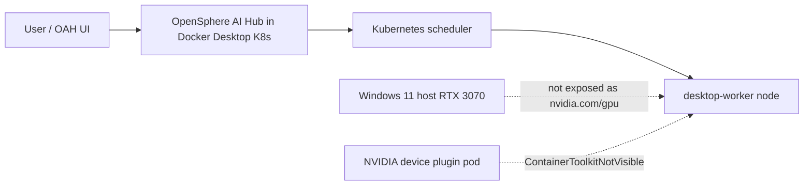
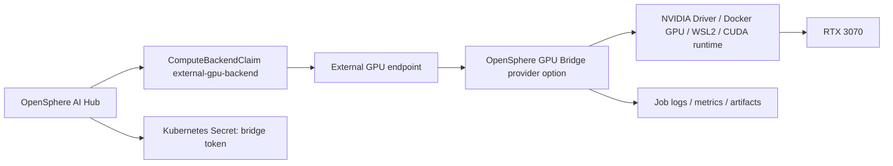
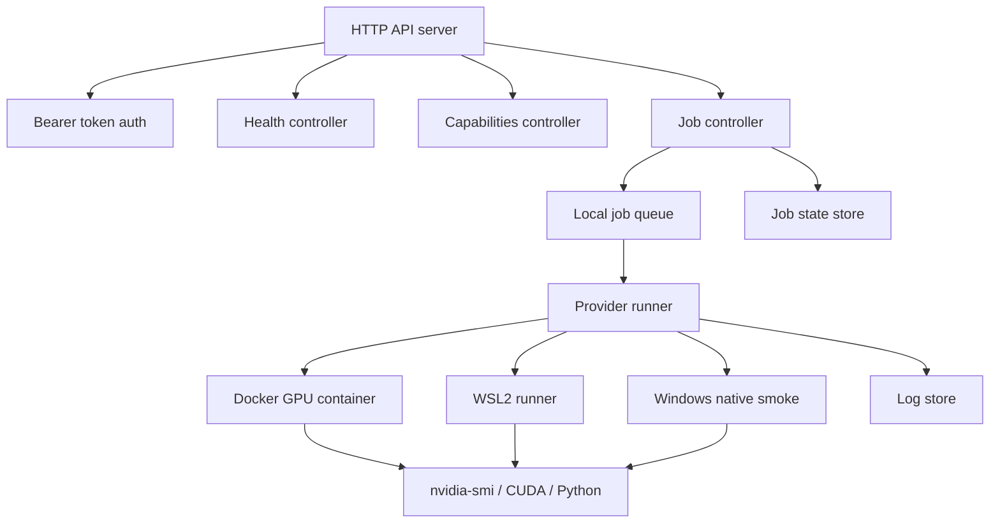

# External GPU Endpoint 및 Windows OpenSphere GPU Bridge 설계 감사 문서

작성일: 2026-06-27  
대상 제품: OpenSphere AI Hub, OAH  
대상 환경: Windows 11 + NVIDIA RTX 3070 + Docker Desktop Kubernetes  
문서 목적: External GPU endpoint와 Windows용 OpenSphere GPU Bridge 서비스/설치 파일 개발 방향을 감사 가능한 수준으로 정의하고, 진행 여부 결정을 지원한다.

## 1. 결론 요약

현재 Windows 11 호스트에는 NVIDIA RTX 3070이 있고 `nvidia-smi`가 동작한다. 그러나 Docker Desktop Kubernetes 노드에는 `nvidia.com/gpu` 같은 Kubernetes extended resource가 노출되지 않는다.

현재 확인된 상태는 다음과 같다.

| 항목 | 상태 |
| --- | --- |
| Windows host GPU | NVIDIA GeForce RTX 3070 |
| NVIDIA driver | 595.95 |
| Kubernetes node `nvidia.com/gpu` | 없음 |
| OAH GPU inventory phase | `PluginDetectedNoResource` |
| GPU plugin pod | 2개 감지 |
| allocatable GPU | 0 |
| 주요 진단 | `ContainerToolkitNotVisible` |
| Docker `--gpus all` | 정상 동작 확인 |

따라서 OpenSphere AI Hub가 현재 Docker Desktop Kubernetes 내부에서 GPU를 네이티브하게 사용할 수는 없다. 다만 같은 호스트의 Docker Linux runtime에서는 `docker run --gpus all ... nvidia-smi`가 성공했다. 즉 Kubernetes native GPU 경로는 막혀 있지만, Docker/WSL2 GPU runtime 경로는 사용 가능하다.

이 제약을 우회하는 현실적인 제품 경로는 하나가 아니다. OAH는 상황별로 다음 서비스를 선택할 수 있어야 한다.

- Docker GPU Bridge container
- Windows Native GPU Bridge service
- Windows Native Supervisor + Docker/WSL2 worker
- Remote External GPU Compute Backend
- Native Kubernetes GPU resource

즉 External GPU endpoint는 특정 구현 하나가 아니라, OAH가 외부 연산 자원을 표준 계약으로 연결하는 서비스 목록이다.

단, 이것은 Kubernetes 표준 GPU 스케줄링이 아니다. Kubernetes 표준 경로는 device plugin이 노드에 `nvidia.com/gpu`를 노출하고 Pod가 해당 extended resource를 요청하는 방식이다. External GPU endpoint는 OpenSphere가 자체적으로 정의해야 하는 외부 compute backend 계약이다.

## 2. 문제 정의

### 2.1 현재 문제가 아닌 것

이 문제는 LiteLLM, OpenAI-compatible API, vLLM endpoint, Ollama endpoint 연결 문제와 다르다.

LiteLLM 계층은 이미 떠 있는 모델 API에 요청을 라우팅한다.

```text
OAH / App -> LiteLLM -> LLM Provider API
```

External GPU endpoint는 GPU 자원에서 작업을 실행하는 compute backend 문제다.

```text
OAH -> External GPU Compute Backend -> Windows/WSL GPU runtime -> RTX 3070
```

### 2.2 현재 해결하려는 문제

Docker Desktop Kubernetes가 Windows 호스트의 RTX 3070을 Kubernetes GPU resource로 노출하지 못한다. 하지만 같은 Windows 호스트에서는 GPU가 존재하고 NVIDIA driver가 동작한다.

따라서 목표는 다음이다.

- Kubernetes native GPU가 없더라도 OAH에서 GPU 기반 작업을 실행할 수 있게 한다.
- Windows 호스트 GPU를 직접 또는 container/WSL2 worker를 통해 사용하는 bridge 서비스를 제공한다.
- OAH는 bridge를 external compute backend로 인식하고 health, capabilities, job lifecycle을 관리한다.
- 사용자는 `/ai/cluster-settings/gpu`에서 endpoint, credential, concurrency를 설정하고 연결 상태를 검증한다.

## 3. 범위

### 3.1 포함 범위

- OAH External GPU Compute Backend API 계약 정의
- OAH가 제공해야 할 External Compute Backend provider/service option 정의
- Docker container 기반 OpenSphere GPU Bridge 설계
- Windows OpenSphere GPU Bridge 서비스 설계
- Windows supervisor/installer 설계
- OAH UI 연동 설계
- 인증, 보안, 네트워크, 로그, 업데이트/삭제 정책
- smoke test 및 인수 기준
- 리스크와 감사 체크리스트

### 3.2 제외 범위

- Docker Desktop Kubernetes에 NVIDIA GPU를 native extended resource로 노출하는 문제 자체 해결
- OKD/OpenShift GPU Operator 설치
- NVIDIA GPU Operator를 Windows Docker Desktop K8s에서 완전 지원하도록 만드는 작업
- 임의의 LiteLLM/vLLM endpoint를 External GPU Compute Backend로 간주하는 것
- 멀티 사용자 GPU quota/billing의 완전한 1차 구현

## 4. 핵심 용어

| 용어 | 의미 |
| --- | --- |
| External GPU endpoint | OAH가 GPU 작업을 제출할 수 있는 외부 compute backend URL |
| OpenSphere GPU Bridge | Docker/Windows/WSL/remote 환경에서 GPU를 사용하고 OAH API 계약을 구현하는 서비스 |
| ComputeBackendClaim | OAH가 사용할 compute backend를 선언하는 OpenSphere 리소스 |
| Native GPU | Kubernetes node allocatable에 `nvidia.com/gpu`처럼 노출된 GPU |
| LiteLLM route | 모델 API 호출 라우팅 계층. GPU 작업 실행 backend와 다름 |
| Provider option | OAH가 External Compute Backend를 연결할 때 제공하는 구현 선택지 |

## 5. 아키텍처

### 5.1 현재 상태



### 5.2 목표 상태



### 5.3 OAH Compute Backend 서비스 카탈로그

이 설계에서 가장 중요한 점은 GPU 연결 방식이 **택1의 제품 결정**이 아니라는 것이다. OAH 입장에서는 여러 실행 환경을 수용하는 **Compute Backend 서비스 카탈로그**를 제공해야 한다.

즉 사용자가 한 번 선택하면 끝나는 옵션이 아니라, 상황에 따라 다음이 가능해야 한다.

- 여러 backend를 동시에 등록한다.
- 워크로드별로 backend를 선택한다.
- backend마다 연결 필드, 검증 절차, readiness 기준을 다르게 적용한다.
- 현재 활성 backend와 대체 backend를 구분해서 표시한다.
- health, capabilities, smoke, job evidence를 같은 방식으로 모니터링한다.
- native GPU가 나중에 가능해지면 external backend에서 native backend로 전환할 수 있다.

OAH는 최소한 다음 서비스를 카탈로그로 제공해야 한다.

| OAH service | 실행 위치 | GPU/compute 접근 방식 | OAH endpoint 예 | 주요 용도 | 현재 환경 적합도 |
| --- | --- | --- | --- | --- | --- |
| Native Kubernetes GPU | Kubernetes node | Device Plugin이 `nvidia.com/gpu` 또는 vendor extended resource 노출 | 내부 Kubernetes scheduling | 운영형 K8s/OKD/OpenShift, GPU Operator 기반 운영 | 현재 Docker Desktop K8s에서는 실패 |
| Docker GPU Bridge container | Docker Desktop Linux runtime | `docker run --gpus all` 기반 Linux CUDA container | `http://host.docker.internal:18080` | 현재 Windows 개발 환경 MVP, 빠른 검증 | 높음. 현재 `--gpus all` 성공 |
| Windows Native GPU Bridge service | Windows Service | `nvidia-smi`, Windows CUDA, 또는 worker delegation | `http://host.docker.internal:18080` | 설치형 제품, 자동 시작, 방화벽/DPAPI/token 관리 | 중간. 제품화 단계 적합 |
| Windows Supervisor + Docker/WSL2 worker | Windows Service + Docker/WSL2 | supervisor가 Docker/WSL2 GPU worker 실행/감시 | `http://host.docker.internal:18080` | Windows 설치 경험 + Linux CUDA runtime 안정성 | 높음. 장기 권장 |
| WSL2 GPU Bridge | WSL2 Linux distro | WSL2 CUDA runtime | `http://<wsl-ip>:18080` 또는 port proxy | Linux runtime 친화 작업, 개발자 고급 구성 | 중간. 네트워크/서비스 관리 필요 |
| Remote External GPU Backend | 원격 서버/워크스테이션/cloud | 원격 GPU runtime | `https://gpu-backend.example.com` | 하이브리드/원격 GPU pool, 팀 공유 GPU | 높음. API contract 동일 |
| Colab / Notebook Bridge | Notebook bridge service | notebook runtime의 GPU session 사용 | bridge endpoint | 실험/교육/임시 GPU session | 제한적. managed scheduling 아님 |
| CPU Fallback Backend | OAH cluster 또는 외부 CPU runner | GPU 없이 CPU로 smoke, preprocessing, small inference 실행 | 내부 job 또는 external endpoint | GPU 부재 시 최소 기능 유지 | 높음. 항상 필요 |
| Model API Router | LiteLLM/vLLM/Ollama/OpenAI-compatible endpoint | 이미 실행 중인 모델 API 호출 | `https://llm-router...` | 추론 API 라우팅 | compute backend가 아니며 별도 서비스로 표시 |

OAH UI는 이 표를 단순 설명 문서로만 두면 안 된다. `/ai/cluster-settings/gpu`에서는 이 서비스 카탈로그를 기반으로 다음 사용자 경험을 제공해야 한다.

- **Available services**: 현재 환경에서 감지/등록/설정 가능한 backend 목록
- **Recommended service**: 현재 조건에서 가장 현실적인 backend
- **Active backend**: 신규 training/inference job의 기본 목적지
- **Fallback backend**: active backend 실패 시 사용 가능한 대체 목적지
- **Verification**: service별 health, capabilities, smoke, credential, endpoint 검증
- **Evidence**: 실제 job id, GPU 이름, memory 사용량, 로그, 마지막 성공 시간

따라서 `External GPU endpoint`는 위 카탈로그 안의 한 서비스 유형이며, Docker/Windows/WSL2/Remote/Colab 구현을 모두 포괄하는 공통 연결 계약으로 관리해야 한다.

### 5.4 현재 환경에서 검증된 provider

현재 Windows 11 + RTX 3070 환경에서는 다음 테스트가 성공했다.

```powershell
docker run --rm --gpus all nvidia/cuda:12.4.1-base-ubuntu22.04 nvidia-smi
```

결과 요약:

| 항목 | 값 |
| --- | --- |
| GPU | NVIDIA GeForce RTX 3070 |
| Driver | 595.95 |
| Container CUDA report | 13.2 |
| Docker runtime | `nvidia` runtime registered |
| 판단 | Docker GPU Bridge container MVP 가능 |

따라서 Phase 1 MVP는 Windows native service보다 **Docker GPU Bridge container**로 먼저 검증할 수 있다. Windows native service는 이후 supervisor/installer/보안 저장소/방화벽/자동 시작을 담당하는 제품형 구성요소로 확장하는 것이 합리적이다.

### 5.5 네트워크 경로

Docker Desktop Kubernetes에서 Windows host 서비스 접근은 보통 다음 후보를 사용한다.

| 후보 endpoint | 용도 |
| --- | --- |
| `http://host.docker.internal:18080` | Docker Desktop 내부에서 Windows host 접근 |
| `http://<windows-host-ip>:18080` | 같은 LAN 또는 명시 IP 접근 |
| `https://<dns-name>:18443` | 인증서/운영형 접근 |

MVP에서는 `http://host.docker.internal:18080`을 로컬 개발 preset으로 제공할 수 있다. 운영형은 HTTPS를 기본으로 해야 한다.

## 6. OAH External Compute Backend API 계약

External GPU endpoint는 단순 URL이 아니라 다음 API 계약을 구현한 서비스여야 한다.

### 6.1 인증

OAH는 Kubernetes Secret에 저장된 token을 사용한다.

요청 헤더:

```http
Authorization: Bearer <token>
Content-Type: application/json
X-OpenSphere-Request-Id: <uuid>
```

MVP에서는 bearer token을 사용한다. 이후 mTLS 또는 signed request를 추가할 수 있다.

### 6.2 Health API

```http
GET /health
```

응답 예:

```json
{
  "status": "ok",
  "service": "opensphere-gpu-bridge",
  "version": "0.1.0",
  "host": "DESKTOP-RTX3070",
  "time": "2026-06-27T10:00:00.000Z"
}
```

### 6.3 Capabilities API

```http
GET /capabilities
```

응답 예:

```json
{
  "backendType": "windows-gpu-bridge",
  "gpus": [
    {
      "id": "0",
      "name": "NVIDIA GeForce RTX 3070",
      "vendor": "nvidia",
      "driverVersion": "595.95",
      "memoryTotalMiB": 8192,
      "cudaAvailable": true
    }
  ],
  "supportedJobTypes": ["smoke", "batch-inference", "training-script"],
  "maxConcurrency": 1,
  "artifactStores": ["local", "http-upload"],
  "limits": {
    "maxRuntimeSeconds": 7200,
    "maxLogBytes": 10485760
  }
}
```

### 6.4 Job Submit API

```http
POST /jobs
```

요청 예:

```json
{
  "jobType": "smoke",
  "image": null,
  "command": ["nvidia-smi"],
  "env": {},
  "inputs": [],
  "outputs": [],
  "resources": {
    "gpuCount": 1,
    "memoryMiB": 2048
  },
  "timeoutSeconds": 300,
  "metadata": {
    "namespace": "opensphere-system",
    "owner": "cmars",
    "requestId": "..."
  }
}
```

응답 예:

```json
{
  "jobId": "job-20260627-000001",
  "phase": "Queued",
  "createdAt": "2026-06-27T10:00:00.000Z"
}
```

### 6.5 Job Status API

```http
GET /jobs/{jobId}
```

응답 예:

```json
{
  "jobId": "job-20260627-000001",
  "phase": "Succeeded",
  "startedAt": "2026-06-27T10:00:02.000Z",
  "finishedAt": "2026-06-27T10:00:04.000Z",
  "exitCode": 0,
  "gpu": {
    "name": "NVIDIA GeForce RTX 3070",
    "utilizationPercent": 12,
    "memoryUsedMiB": 512
  },
  "artifacts": []
}
```

### 6.6 Logs API

```http
GET /jobs/{jobId}/logs?tail=200
```

응답 예:

```json
{
  "jobId": "job-20260627-000001",
  "lines": [
    "NVIDIA-SMI 595.95 ...",
    "GPU 0: NVIDIA GeForce RTX 3070"
  ],
  "truncated": false
}
```

### 6.7 Cancel API

```http
POST /jobs/{jobId}/cancel
```

응답 예:

```json
{
  "jobId": "job-20260627-000001",
  "phase": "Cancelling"
}
```

## 7. OpenSphere GPU Bridge 서비스 설계

### 7.1 서비스 책임

OpenSphere GPU Bridge provider는 구현 방식과 무관하게 다음을 책임진다.

- OAH API 계약 구현
- 인증 token 검증
- `nvidia-smi` 기반 GPU discovery
- Docker GPU, WSL2, Windows native CUDA/Python runtime discovery
- job queue 관리
- job process 실행/중지
- stdout/stderr 로그 수집
- job status 저장
- health/capability/status/log API 제공
- provider별 네트워크/포트/로그 위치 운영

구현 방식별 추가 책임은 다르다.

| Provider | 추가 책임 |
| --- | --- |
| Docker GPU Bridge container | 컨테이너 내부 API server, `--gpus all` 기반 GPU 접근, volume/log mount |
| Windows Native GPU Bridge service | Windows Service, 방화벽 rule, DPAPI token, 자동 시작 |
| Windows Supervisor + Docker/WSL2 worker | Windows 설치/운영 제어 + Docker/WSL2 worker 실행/감시 |
| Remote External GPU Backend | TLS, 원격 인증, 원격 job isolation, artifact endpoint |

### 7.2 서비스가 책임지지 않는 것

- Kubernetes scheduler 역할
- Kubernetes Pod 실행
- GPU driver 설치 대행
- 임의 컨테이너 샌드박스 보안 완전 보장
- 다중 사용자 격리 완전 보장

### 7.3 구현 및 런타임 선택지

| 선택지 | 장점 | 단점 | 권장 |
| --- | --- | --- | --- |
| Docker GPU Bridge container | 현재 환경에서 `--gpus all` 검증 완료, Linux CUDA runtime 표준화, 빠른 MVP | Docker Desktop/WSL2 GPU runtime에 의존, Windows service 경험 없음 | Phase 1 기본 MVP |
| Go 단일 exe | Windows service 구현 쉬움, 배포 단순, 메모리 작음 | ML job 실행 ecosystem 직접 연결 필요 | 서비스 코어 권장 |
| Node.js | 현재 OAH 서버 코드와 친숙, 빠른 개발 | Windows service wrapping 필요, 설치물 커짐 | MVP 가능 |
| Python/FastAPI | ML runtime과 친화적 | 서비스/패키징/보안 관리 부담 | worker side 가능 |
| .NET Worker Service | Windows 서비스 친화적 | 기존 repo 기술스택과 거리 | Windows 전용이면 가능 |

권장안은 **container-first MVP + Windows native supervisor 제품화**다.

Phase 1에서는 Docker GPU Bridge container로 API contract를 빠르게 검증한다. 이후 제품화 단계에서 Windows native supervisor가 설치/자동 시작/방화벽/DPAPI/업데이트를 담당하고, 실제 GPU 작업은 Docker/WSL2 worker로 실행하는 구조가 가장 안정적이다.

### 7.4 내부 컴포넌트



### 7.5 데이터 저장 위치

| 데이터 | 기본 위치 |
| --- | --- |
| config | `%ProgramData%\OpenSphere\GPUBridge\config.yaml` |
| token hash | `%ProgramData%\OpenSphere\GPUBridge\secrets.json` |
| logs | `%ProgramData%\OpenSphere\GPUBridge\logs` |
| jobs | `%ProgramData%\OpenSphere\GPUBridge\jobs` |
| artifacts | `%ProgramData%\OpenSphere\GPUBridge\artifacts` |

## 8. Windows 설치 파일 설계

### 8.1 왜 설치 파일이 필요한가

수동으로 Python/Node 서버를 띄우는 방식은 제품 경험이 아니다. 완성형 제품 기준에서는 다음이 필요하다.

- Windows service 등록
- 부팅 후 자동 시작
- 설정 파일 생성
- 인증 token 생성 또는 입력
- Windows Firewall rule 생성
- 로그 경로 생성
- service start/stop/restart
- update/uninstall
- 사전 점검 결과 표시

### 8.2 설치 도구 후보

| 후보 | 장점 | 단점 | 권장 |
| --- | --- | --- | --- |
| WiX Toolset | MSI 표준, enterprise 배포 친화적 | 학습/작성 비용 있음 | 운영형 권장 |
| Inno Setup | 빠른 설치 파일 제작, UX 쉬움 | MSI 정책/기업 배포는 약함 | MVP 권장 |
| NSIS | 유연함 | 유지보수 난이도 | 보조 후보 |
| PowerShell installer | 빠른 내부 검증 | 제품 설치 경험 부족 | 개발용 |

권장 단계:

1. MVP: PowerShell installer 또는 Inno Setup
2. 제품화: WiX Toolset MSI

### 8.3 설치 시 수행 작업

1. 설치 디렉터리 생성
   - `%ProgramFiles%\OpenSphere\GPUBridge`
2. 데이터 디렉터리 생성
   - `%ProgramData%\OpenSphere\GPUBridge`
3. 실행 파일 복사
4. config 생성
   - listen address
   - port
   - max concurrency
   - log retention
5. token 생성 또는 사용자 입력
6. Windows Service 등록
   - service name: `OpenSphereGPUBridge`
   - display name: `OpenSphere GPU Bridge`
7. Windows Firewall inbound rule 생성
   - 기본 port: 18080
8. 사전 점검 실행
   - `nvidia-smi`
   - GPU memory
   - driver version
   - port bind 가능 여부
9. 서비스 시작
10. 설치 완료 화면에 endpoint/token 안내

### 8.4 설치 완료 출력

설치 완료 후 사용자는 OAH에 다음 값을 입력한다.

| OAH 필드 | 값 예 |
| --- | --- |
| Usage option | External GPU endpoint |
| External endpoint | `http://host.docker.internal:18080` |
| Credential Secret | `oah-external-gpu-credentials` |
| Resource name | `external.opensphere.io/gpu` |
| Max concurrency | `1` |

Kubernetes Secret 예:

```yaml
apiVersion: v1
kind: Secret
metadata:
  name: oah-external-gpu-credentials
  namespace: opensphere-system
type: Opaque
stringData:
  token: "<generated-token>"
```

## 9. OAH UI 연동 설계

현재 `/ai/cluster-settings/gpu`는 다음 방향으로 확장되어야 한다.

### 9.1 Compute Backend 서비스 카탈로그 UI

`/ai/cluster-settings/gpu`는 "하나의 GPU option을 선택하는 폼"이 아니라, OAH가 제공하는 compute backend 서비스를 등록하고 검증하는 화면이어야 한다.

화면은 다음 영역으로 구성한다.

| 영역 | 목적 |
| --- | --- |
| Connected resources | 현재 감지된 Kubernetes GPU, Docker bridge, external backend, CPU fallback 상태를 한눈에 표시 |
| Service catalog | OAH가 제공하는 backend 서비스 목록 표시 |
| Configure selected service | 선택한 서비스 유형에 필요한 필드만 표시 |
| Verification and evidence | health/capabilities/smoke/job evidence 결과 표시 |
| Workload routing | training, serving, pipeline, batch inference가 어떤 backend를 기본으로 사용할지 표시 |

Workload routing은 단순 화면 상태가 아니라 OAH 운영 설정으로 저장되어야 한다. 현재 구현 기준으로는 `opensphere-system/oah-compute-routing` ConfigMap에 workload별 primary/fallback backend를 저장한다.

| Workload | Routing 의미 |
| --- | --- |
| Training jobs | TrainingJobClaim 또는 training smoke가 기본으로 사용할 compute backend |
| Model serving / inference | InferenceClaim, serving runtime, promoted model endpoint의 기본 backend |
| Workbench notebooks | 사용자가 notebook/workbench runtime을 시작할 때 우선 참조할 backend |
| Data science pipelines | pipeline step 중 GPU/CPU compute가 필요한 단계의 기본 backend |
| Batch inference | offline inference, embedding refresh, indexing job의 기본 backend |
| Distributed workloads | Ray/Kueue/JobSet 계열 workload가 우선 사용할 backend |

각 workload는 primary backend와 fallback backend를 가진다. 이 구성은 "GPU 방식 중 하나를 영구 선택"하는 것이 아니라, 서비스 카탈로그에 등록된 여러 backend를 workload 목적에 맞게 라우팅하는 정책이다.

생성 API는 사용자가 `computeBackendRef`를 명시하지 않은 경우 이 routing 정책을 기본값으로 적용한다. 예를 들어 TrainingJobClaim 생성 시 training route의 primary backend가 자동으로 `spec.computeBackendRef`에 들어가고, 적용된 backend는 `opensphere.io/compute-routing-backend` annotation으로 추적된다. primary backend가 준비되지 않은 경우에는 fallback backend를 사용한다.

OAH가 제공해야 할 서비스 카탈로그 항목:

| Service | UI label | 필수 구성 값 | 검증 방식 |
| --- | --- | --- | --- |
| Native Kubernetes GPU | Kubernetes GPU resource | resource name, node selector, namespace | node allocatable, device plugin pod, sample pod scheduling |
| Docker GPU Bridge container | Local Docker GPU Bridge | endpoint, token secret, resource name, max concurrency | health, capabilities, smoke job |
| Windows Native GPU Bridge service | Windows GPU Bridge Service | endpoint, token secret, listen address, firewall status | health, capabilities, service status, smoke job |
| Windows Supervisor + Docker/WSL2 worker | Windows GPU Supervisor | endpoint, token secret, worker runtime, worker image | supervisor health, worker capabilities, smoke job |
| WSL2 GPU Bridge | WSL2 GPU Bridge | endpoint, token secret, WSL distro, port proxy | health, capabilities, smoke job |
| Remote External GPU Backend | Remote GPU Backend | endpoint, token secret, TLS mode, max concurrency | health, capabilities, smoke job, latency |
| Colab / Notebook Bridge | Notebook GPU Bridge | notebook bridge URL, session token, session TTL | session liveness, capabilities, limited smoke |
| CPU Fallback Backend | CPU fallback | namespace, resource limits | small smoke job |
| Model API Router | Model API / LiteLLM route | base URL, model name, API secret | model list, completion test |

Local Docker GPU Bridge 선택 시 기본값:

| 필드 | 기본값 |
| --- | --- |
| endpoint | `http://host.docker.internal:18080` |
| resource name | `external.opensphere.io/gpu` |
| credential secret | `oah-external-gpu-credentials` |
| max concurrency | `1` |

Model API Router는 GPU compute backend가 아니다. UI에서는 같은 AI 인프라 설정 영역에 표시할 수 있지만, training job의 실행 목적지가 아니라 inference API 라우팅 서비스로 구분해야 한다.

### 9.2 연결 테스트 버튼

필수 버튼:

- Test health
- Read capabilities
- Run smoke job
- Create/Update ComputeBackendClaim

추가 버튼:

- Set as active backend
- Set as fallback backend
- Run training smoke
- View job evidence

### 9.3 상태 모델

| 상태 | 의미 |
| --- | --- |
| `ExternalEndpointRequired` | endpoint가 비어 있음 |
| `ExternalEndpointInvalid` | URL 형식이 아님 |
| `ExternalEndpointUnreachable` | endpoint 호출 실패 |
| `ExternalAuthFailed` | token 인증 실패 |
| `ExternalCapabilitiesReady` | `/capabilities` 성공 |
| `ExternalSmokePassed` | smoke job 성공 |
| `ExternalGpuConfigured` | ComputeBackendClaim 생성 가능 |

현재 구현은 URL 형식 검증까지 포함한다. 운영형 연결 완료를 말하려면 health/capabilities/smoke 검증까지 필요하다.

## 10. ComputeBackendClaim 모델

External GPU endpoint 연결 결과는 다음 형태의 리소스로 표현한다.

```yaml
apiVersion: ai.opensphere.io/v1alpha1
kind: ComputeBackendClaim
metadata:
  name: external-gpu-backend
  namespace: opensphere-system
spec:
  backendType: external
  resourceName: external.opensphere.io/gpu
  endpoint: http://host.docker.internal:18080
  credentialSecretRef: oah-external-gpu-credentials
  maxConcurrency: 1
```

주의:

- `resourceName`은 Kubernetes node allocatable resource가 아니다.
- external mode에서는 `resourceName`이 OAH 내부 compute backend 식별자 역할을 한다.
- 실제 GPU 사용 가능 여부는 endpoint capabilities와 smoke job으로 검증해야 한다.

## 11. 보안 설계

### 11.1 인증

MVP:

- bearer token
- token은 installer가 생성
- token 평문은 설치 완료 시 한 번 표시
- Windows 측에는 hash 또는 보호 저장소 사용
- OAH 측에는 Kubernetes Secret 저장

운영형:

- mTLS
- token rotation
- Secret rotation UI
- audit log 연동

### 11.2 네트워크

기본 정책:

- 개발: HTTP local network 허용 가능
- 운영: HTTPS 필수
- listen address 기본값은 `127.0.0.1` 또는 명시 선택
- Docker Desktop 연동을 위해 `0.0.0.0:18080`이 필요할 수 있으나 설치 UI에서 명확히 경고

### 11.3 작업 실행 보안

MVP에서 허용할 job type은 제한해야 한다.

허용:

- `smoke`: `nvidia-smi`, 짧은 GPU 진단
- `batch-inference`: 사전 등록된 runner만 실행
- `training-script`: 관리자가 허용한 workspace/job template만 실행

금지 또는 후순위:

- 임의 shell command 실행
- 사용자 제공 binary 실행
- 무제한 파일시스템 접근
- 장시간 무제한 job

## 12. 작업 유형별 지원 단계

| 단계 | 지원 작업 | 설명 |
| --- | --- | --- |
| MVP | health/capabilities/smoke | 연결 검증 중심 |
| 1차 제품 | batch inference | 입력 파일 -> 결과 파일 |
| 2차 제품 | training script | 사전 정의된 Python env 또는 venv |
| 3차 제품 | notebook bridge | Jupyter/Colab류 runtime 연결 |
| 4차 제품 | model serving bridge | 장기 실행 serving process 관리 |

## 13. 감사 체크리스트

### 13.1 제품 방향 감사

- [ ] 이 기능이 LiteLLM 연결이 아니라 compute backend 연결임을 UI/문서가 명확히 설명하는가?
- [ ] Kubernetes native GPU와 external GPU bridge의 차이를 사용자가 이해할 수 있는가?
- [ ] External endpoint가 단순 URL 입력이 아니라 API contract 구현체임을 설명하는가?
- [ ] Windows RTX 3070 + Docker Desktop 제약을 해결하는 현실적 경로인가?

### 13.2 API 계약 감사

- [ ] `/health` 응답 schema가 고정되어 있는가?
- [ ] `/capabilities`가 GPU 이름, driver, memory, supported job type을 제공하는가?
- [ ] `/jobs`가 idempotency/request id를 지원하는가?
- [ ] job phase enum이 OAH와 Bridge에서 동일한가?
- [ ] logs/cancel API가 정의되어 있는가?
- [ ] 인증 실패/권한 부족/리소스 부족 오류 코드가 정의되어 있는가?

### 13.3 보안 감사

- [ ] token 저장 방식이 명확한가?
- [ ] Windows 방화벽 rule 생성이 사용자 승인 하에 수행되는가?
- [ ] 외부 네트워크 공개 시 경고가 있는가?
- [ ] 임의 명령 실행을 막는가?
- [ ] 로그에 token이 남지 않는가?
- [ ] job working directory가 격리되는가?

### 13.4 설치 파일 감사

- [ ] 설치/업데이트/삭제가 모두 가능한가?
- [ ] Windows Service 등록/삭제가 정상인가?
- [ ] 사전 점검 실패 시 사용자에게 이유를 설명하는가?
- [ ] 설치 완료 후 OAH에 입력할 endpoint와 secret 생성 방법을 제공하는가?
- [ ] 포트 충돌을 감지하는가?

### 13.5 운영 감사

- [ ] service health가 OAH UI에서 보이는가?
- [ ] capabilities가 OAH UI에 표시되는가?
- [ ] smoke job 결과가 OAH UI에 표시되는가?
- [ ] job log와 audit log가 연결되는가?
- [ ] 실패 시 next step이 구체적인가?

## 14. 구현 단계

### Phase 0: 설계 승인

산출물:

- 본 문서 감사
- API contract 확정
- OAH provider/service option 목록 확정
- 보안 수준 결정
- MVP 범위 결정

진행 여부 결정 질문:

1. OAH가 External Compute Backend provider list를 제품 기능으로 제공할 것인가?
2. Phase 1 기본 provider를 Docker GPU Bridge container로 시작할 것인가?
3. MVP에서 임의 training job까지 허용할 것인가, smoke/batch까지만 허용할 것인가?
4. HTTP local bridge를 허용할 것인가, 처음부터 HTTPS를 요구할 것인가?

### Phase 1: Containerized Bridge MVP

산출물:

- Docker GPU Bridge container image
- `GET /health`
- `GET /capabilities`
- `POST /jobs` smoke only
- `GET /jobs/{id}`
- `GET /jobs/{id}/logs`
- `POST /jobs/{id}/cancel`
- bearer token auth
- OAH Local Docker GPU Bridge preset

인수 기준:

- Windows host에서 `docker run --gpus all` 성공
- Docker GPU Bridge container 실행
- `nvidia-smi` 기반 capabilities 표시
- OAH에서 endpoint health 확인
- OAH에서 smoke job 실행 후 RTX 3070 정보 표시
- Kubernetes native GPU가 없어도 External Compute Backend로 감지

### Phase 2: Windows Supervisor / Installer MVP

산출물:

- Windows native supervisor executable
- PowerShell 또는 Inno Setup installer
- Windows Service 등록
- token 생성
- firewall rule 생성
- uninstall
- Docker/WSL2 worker runtime discovery

인수 기준:

- 깨끗한 Windows 11 환경에서 설치 성공
- 재부팅 후 서비스 자동 시작
- OAH에서 `host.docker.internal:18080` 접근 성공
- supervisor가 Docker GPU Bridge 또는 WSL2 worker를 시작/감시 가능

### Phase 3: OAH UI/Controller 연동

산출물:

- External Compute Backend provider list
- Local Docker GPU Bridge preset
- Local Windows GPU Bridge preset
- WSL2 GPU Bridge preset
- Remote External GPU Backend preset
- health/capabilities/smoke test 버튼
- ComputeBackendClaim create/update
- status/audit 표시

인수 기준:

- External endpoint 입력만으로 configured 처리하지 않음
- health/capabilities/smoke를 통과해야 ready로 표시
- secret 누락/인증 실패/endpoint 실패가 구분됨
- provider option별 next step이 다르게 표시됨

### Phase 4: 작업 확장

산출물:

- batch inference runner
- training script runner
- artifact upload/download
- job queue/concurrency policy

인수 기준:

- OAH pipeline/training job에서 External GPU backend 선택 가능
- 로그와 artifact가 OAH 화면에서 조회 가능
- 실패 job 재시도/취소 가능

## 15. 리스크

| 리스크 | 영향 | 대응 |
| --- | --- | --- |
| Windows host 보안 노출 | 높음 | 기본 localhost, explicit firewall approval, token auth |
| 임의 명령 실행 위험 | 높음 | job type allowlist, template 기반 실행 |
| HTTPS 인증서 UX 복잡도 | 중간 | MVP는 local HTTP, 운영형은 HTTPS profile |
| Docker Desktop 네트워크 차이 | 중간 | `host.docker.internal` + host IP fallback |
| GPU driver/CUDA 환경 차이 | 중간 | capabilities에 정확히 표시, smoke test 필수 |
| 장시간 job 관리 | 중간 | timeout, cancel, log retention |
| 제품 범위 과대화 | 높음 | MVP를 health/capabilities/smoke로 제한 |

## 16. 결정 필요 사항

| 결정 항목 | 선택지 | 권장 |
| --- | --- | --- |
| OAH 제공 모델 | 단일 External endpoint / service catalog | service catalog |
| Phase 1 구현 우선순위 | Windows native service / Docker GPU container / WSL2 / remote | Docker GPU container |
| Bridge 구현 언어 | Go / Node.js / Python / .NET | Go 또는 Node.js MVP |
| Windows 제품화 | 없음 / supervisor / full native worker | supervisor + Docker/WSL2 worker |
| Installer | PowerShell / Inno Setup / WiX | supervisor 단계에서 Inno Setup, 제품화 WiX |
| 기본 endpoint | HTTP / HTTPS | 개발 HTTP, 운영 HTTPS |
| MVP job type | smoke only / batch / training | smoke only부터 |
| token 저장 | 평문 / hash / Windows DPAPI | DPAPI 또는 hash |
| OAH ready 기준 | endpoint URL / health / capabilities / smoke | smoke까지 통과 |

## 17. 권장 결정

진행한다면 다음 방향을 권장한다.

1. External GPU endpoint를 **External GPU Compute Backend**로 명확히 재명명한다.
2. OAH는 External Compute Backend를 단일 옵션이 아니라 **서비스 카탈로그**로 제공한다.
   - Native Kubernetes GPU
   - Local Docker GPU Bridge
   - Local Windows GPU Bridge
   - Windows Supervisor + Docker/WSL2 worker
   - WSL2 GPU Bridge
   - Remote External GPU Backend
   - Colab / Notebook Bridge
   - CPU Fallback Backend
   - Model API Router는 compute backend와 분리된 AI service로 표시한다.
3. 현재 환경의 Phase 1 MVP는 **Docker GPU Bridge container**로 시작한다. 이것은 다른 방식을 배제하는 택1 결정이 아니라, 검증 가능한 첫 구현 순위다.
4. Windows용 **OpenSphere GPU Bridge Supervisor**는 제품화 단계의 별도 구성요소로 정의한다.
5. MVP는 연결 검증에 집중한다.
   - health
   - capabilities
   - nvidia-smi smoke job
6. OAH UI는 endpoint URL만으로 ready를 표시하지 않는다.
7. `ExternalGpuConfigured`는 최소한 URL 형식, credential secret, health, capabilities가 통과한 뒤 사용한다.
8. `ExternalGpuReady` 또는 `ExternalSmokePassed`는 smoke job이 성공한 뒤 사용한다.
9. 학습/서빙 job 실행은 Phase 4로 분리한다.

## 18. 최종 판단

Windows 11 + RTX 3070 + Docker Desktop Kubernetes 환경에서 native GPU exposure가 실패하는 현재 조건에서는 External Compute Backend provider 방식이 가장 현실적인 대안이다.

또한 현재 환경에서는 Docker `--gpus all`이 성공했으므로, 가장 빠른 MVP는 Windows native service가 아니라 **Docker GPU Bridge container**다. Windows native 구성요소는 GPU 접근 자체의 필수 조건이 아니라, 설치형 제품 경험과 운영 제어를 위한 supervisor 역할로 정의하는 것이 맞다.

따라서 이 기능은 단순 endpoint 필드 추가가 아니라 다음 제품 트랙으로 관리해야 한다.

1. OAH External Compute Backend API contract
2. OAH Compute Backend service catalog
3. Docker GPU Bridge container
4. Windows OpenSphere GPU Bridge Supervisor 및 설치/운영 도구
5. WSL2/remote backend 확장

따라서 본 기능은 UI 옵션 수준의 작은 개선이 아니라, **OpenSphere AI Hub의 외부 compute backend 제품 기능**으로 관리해야 한다.
## Appendix A. OAH compute backend methods are service catalog entries

The methods in this document are not a mutually exclusive one-time product decision. They are service catalog entries that OAH should expose for different operating situations.

OAH must present these methods as selectable, testable, routable, and monitorable compute services:

| OAH service option | When it is used | OAH responsibility | Output visible to user |
| --- | --- | --- | --- |
| Native Kubernetes GPU | Cluster nodes expose `nvidia.com/gpu` or another GPU extended resource | Inventory, scheduling labels, resource readiness, workload placement | GPU node count, allocatable GPUs, device plugin state, sample scheduling result |
| Docker GPU Bridge container | Docker Desktop can run `docker run --gpus all`, but Kubernetes cannot expose GPU resources | Endpoint configuration, Secret-based token auth, health/capabilities/smoke validation | bridge health, GPU model, memory, smoke job id/logs |
| Windows Native GPU Bridge service | A Windows host GPU must be used without relying on Kubernetes GPU exposure | Installer/service lifecycle, firewall guidance, token storage, bridge health | Windows service state, endpoint state, GPU diagnostics |
| Windows Supervisor + Docker/WSL2 worker | Windows service is needed, but jobs should run in Linux CUDA containers | Supervisor config, worker image policy, job allowlist, logs and cancellation | supervisor state, worker runtime state, job evidence |
| WSL2 GPU Bridge | WSL2 CUDA runtime is the stable execution layer | Endpoint registration, WSL bridge health, GPU capabilities | WSL distro, endpoint, GPU capability, smoke logs |
| Remote External GPU Backend | GPU capacity lives on another workstation, server, or cloud | Endpoint contract, credentials, concurrency and readiness monitoring | latency, remote capabilities, concurrency, recent job evidence |
| Colab / Notebook Bridge | Notebook session is used as an external interactive GPU runtime | Notebook bridge endpoint, session liveness, limited job lifecycle | session status, runtime GPU, expiration, supported job limits |
| CPU Fallback Backend | GPU is absent or temporarily unavailable | CPU resource policy, small-job execution, clear degraded-state messaging | CPU fallback ready state, limited job capability |
| Model API Router | OAH only needs to call an already running model API | Route registration, credential management, model list/completion test | model endpoint readiness, model list, completion test result |

Therefore `/ai/cluster-settings/gpu` must not communicate "pick one forever". It should communicate: register available services, choose the active backend for each workload type, configure backend-specific fields, verify the endpoint/resource, then monitor the visible result. The active backend can change as the user's environment changes.

The service catalog must also make this boundary explicit:

- Compute Backend services run work: training smoke, batch inference, preprocessing, fine tuning, or other GPU/CPU jobs.
- Model API Router services call work that is already running elsewhere: LiteLLM, vLLM, Ollama, OpenAI-compatible endpoints.
- Both are OAH AI infrastructure services, but they must not be merged into one concept.

## Appendix B. OAH 제공 서비스 목록 요구사항

GPU 사용 방식은 사용자가 하나를 골라 영구 확정하는 설치 옵션이 아니다. OAH 입장에서는 각 방식이 **상황별로 등록, 검증, 선택, 라우팅, 모니터링할 수 있는 서비스**다.

따라서 `/ai/cluster-settings/gpu`의 제품 모델은 다음과 같아야 한다.

1. OAH는 가능한 compute service를 카탈로그로 보여준다.
2. 사용자는 현재 환경에서 가능한 서비스를 하나 이상 등록한다.
3. OAH는 서비스별 readiness를 독립적으로 검증한다.
4. OAH는 workload 종류별로 primary/fallback backend를 설정한다.
5. 실제 TrainingJob, PipelineRun, Inference, Workbench 생성 시 라우팅 정책을 적용한다.
6. 생성된 리소스에는 어떤 backend가 적용되었는지 annotation과 화면 증거로 남긴다.
7. 시간이 지나 환경이 바뀌면 active backend를 다른 서비스로 바꿀 수 있다.

### B.1 서비스는 동시에 존재할 수 있다

예를 들어 현재 개발자 PC에서는 다음 조합이 현실적이다.

| 상황 | 사용 가능한 OAH 서비스 |
| --- | --- |
| Docker Desktop Kubernetes가 GPU를 노출하지 못함 | Native Kubernetes GPU는 Not ready로 표시 |
| 같은 Windows 호스트의 Docker는 `--gpus all` 가능 | Docker GPU Bridge container를 Ready 후보로 표시 |
| 설치형 제품 경험이 필요함 | Windows GPU Bridge Supervisor를 추가 서비스로 표시 |
| 원격 GPU 서버가 있음 | Remote External GPU Backend를 추가 등록 |
| 임시 실험용 notebook GPU가 있음 | Colab / Notebook Bridge를 제한된 서비스로 등록 |
| GPU가 없거나 실패함 | CPU Fallback Backend로 degraded mode 제공 |
| 이미 떠 있는 LLM API만 호출함 | Model API Router로 별도 등록 |

이 조합에서 사용자는 "Docker GPU Bridge를 선택했으니 Remote Backend는 쓸 수 없다"가 아니다. OAH는 둘 다 등록하고, workload별로 우선순위와 fallback을 관리해야 한다.

### B.2 OAH가 제공해야 하는 서비스 카드

| 서비스 카드 | 목적 | 주요 입력 | Ready 판단 | 사용자에게 보여줄 증거 |
| --- | --- | --- | --- | --- |
| Native Kubernetes GPU | 클러스터 안에서 GPU pod를 직접 scheduling | resource name, namespace, node selector | allocatable GPU > 0, device plugin 정상, sample scheduling 성공 | GPU node 수, allocatable GPU, device plugin 상태, sample pod 결과 |
| Local Docker GPU Bridge | Docker Desktop Linux runtime의 GPU를 OAH에 연결 | endpoint, token secret, resource name, concurrency | health, capabilities, smoke job 성공 | GPU 모델, memory, driver, smoke job id/log |
| Windows GPU Bridge Service | Windows 서비스로 GPU bridge를 자동 실행 | listen address, token, firewall, service account | Windows service running, health, capabilities | service state, endpoint, GPU 진단 |
| Windows GPU Supervisor | Windows 서비스가 Docker/WSL2 worker를 관리 | worker runtime, worker image, endpoint, token | supervisor health, worker health, smoke job | supervisor 상태, worker image, job evidence |
| WSL2 GPU Bridge | WSL2 CUDA runtime을 직접 bridge로 사용 | WSL distro, port proxy, token | WSL endpoint health, capabilities | distro, endpoint, GPU capability, smoke logs |
| Remote GPU Backend | 다른 서버/워크스테이션/cloud GPU pool 사용 | URL, TLS mode, token, concurrency | HTTPS/TLS, health, capabilities, latency, smoke | latency, remote GPU 목록, concurrency, recent jobs |
| Notebook GPU Bridge | Colab/Jupyter류 임시 GPU session 연결 | bridge URL, session token, TTL | session alive, limited capabilities | session 만료 시간, GPU type, 제한 사항 |
| CPU Fallback Backend | GPU 실패 시 최소 compute 기능 유지 | namespace, CPU/memory limits | small job 성공 | degraded state, 가능한 작업 목록 |
| Model API Router | 이미 실행 중인 모델 API 호출 | base URL, model id, API secret | model list 또는 completion test 성공 | model list, completion latency, route 상태 |

### B.3 Compute Backend와 Model API Router의 경계

OAH 화면에서는 둘 다 "AI 인프라 서비스"로 보일 수 있지만 의미가 다르다.

| 구분 | Compute Backend | Model API Router |
| --- | --- | --- |
| 하는 일 | 작업을 실행한다 | 이미 실행 중인 모델 API를 호출한다 |
| 예 | training smoke, batch inference, preprocessing, fine tuning | LiteLLM, vLLM endpoint, Ollama, OpenAI-compatible API |
| 리소스 결과 | job id, logs, artifacts, GPU usage | model list, completion result, latency |
| workload routing 대상 | 예 | 아니오. 추론 API route 대상 |
| GPU 직접 사용 | 가능 | 보통 직접 사용하지 않음. GPU는 외부 모델 서버가 사용 |

즉 LiteLLM 연결은 "GPU direct 접속" 문제가 아니다. LiteLLM은 모델 API 라우터이고, External GPU Backend는 OAH가 GPU/CPU compute job을 외부 실행 환경에 위임하는 계약이다.

### B.4 화면 구성 원칙

`/ai/cluster-settings/gpu`는 다음 순서로 읽혀야 한다.

1. **Connected compute resources**
   - 현재 감지된 Kubernetes GPU, Docker bridge, external backend, CPU fallback을 요약한다.
   - 사용자가 "지금 쓸 수 있는 자원"을 먼저 본다.

2. **Compute service catalog**
   - OAH가 제공하는 서비스 카드를 보여준다.
   - 카드는 서로 배타적 radio option이 아니다.
   - 각 카드는 Configure, Test, Register, Set route action을 가진다.

3. **Configure selected service**
   - 선택한 서비스 카드에 필요한 필드만 표시한다.
   - Docker bridge와 Remote backend의 필드는 다르고, Native Kubernetes GPU는 endpoint가 필요 없다.

4. **Verification and evidence**
   - health, capabilities, smoke, 최근 job evidence를 표시한다.
   - "Ready"는 URL 입력만으로 표시하지 않는다.

5. **Workload routing**
   - Training, Serving, Workbench, Pipeline, Batch, Distributed workload별 primary/fallback backend를 지정한다.
   - 사용자가 리소스를 생성할 때 명시하지 않으면 이 정책이 자동 적용된다.

### B.5 현재 환경의 기본 권장 조합

현재 Windows 11 + RTX 3070 + Docker Desktop Kubernetes 환경에서는 다음 조합을 기본으로 둔다.

| 역할 | 권장 서비스 |
| --- | --- |
| Native cluster GPU | Not ready. Docker Desktop Kubernetes가 GPU extended resource를 노출하지 못함 |
| 개발용 GPU compute | Local Docker GPU Bridge |
| 제품형 Windows 설치 경험 | Windows GPU Supervisor, 이후 단계 |
| fallback | CPU Fallback Backend |
| 외부 모델 API 호출 | Model API Router, compute backend와 분리 |

따라서 Phase 1에서 Docker GPU Bridge container를 먼저 구현하는 것은 **서비스 카탈로그 중 첫 번째 검증 대상**이라는 뜻이다. 다른 서비스를 배제하거나 하나의 방식으로 고정한다는 의미가 아니다.
